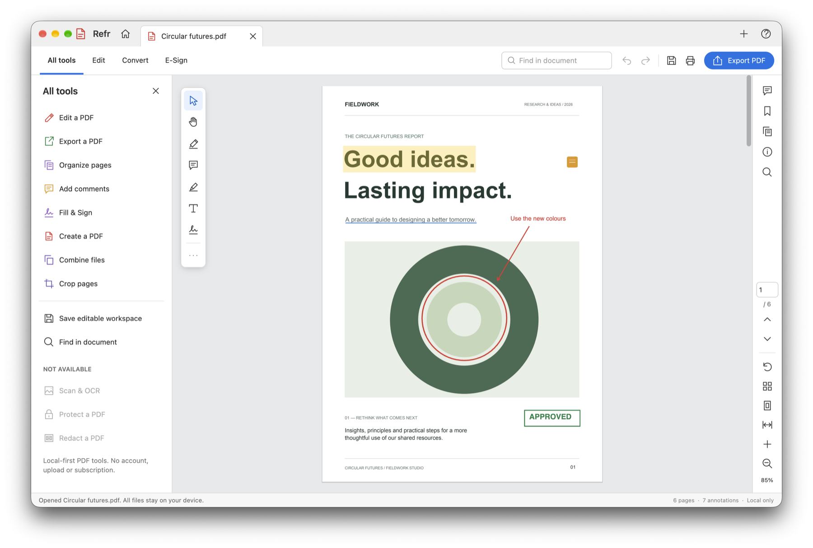

# The workspace

From top to bottom, the Refr window has a title bar with tabs, a global bar, the main
area, and a status bar. The main area has the tool panel on the left, the document in the
middle, and an optional side panel and the navigation rail on the right.

## Title bar and tabs

- **Refr**: click the name to open **About Refr**.
- **Home** (house icon): shows or hides the [Home view](getting-started.md#the-home-view).
- **Tabs**: one per open document. A dot (•) before the title means the document has
  changes that aren't saved in a workspace. Click **×** on a tab, or press **⌘W**, to close
  it. Refr asks first if the document has unsaved changes.
- **+**: opens a file.
- **?**: shows a short keyboard and pointer guide.

Drag an empty part of the title bar to move the window, and double-click it to zoom the
window.

Switch between tabs with **⇧⌘]** and **⇧⌘[**, or **⌃Tab** and **⌃⇧Tab**. When you close the
last tab, Refr opens a blank document in its place.

## Global bar

| Control | Does |
|---|---|
| **All tools**, **Edit**, **Convert**, **E-Sign** | Switch the tool mode (see below) |
| **Find in document** | Searches the document. Hidden when the window is narrower than 1100 pt; use **⌘F** instead |
| **Undo** and **Redo** | Hover to see what they'll undo or redo, such as "Undo Add highlight" |
| **Save** | Saves the editable workspace (**⌘S**) |
| **Print** | Prints (**⌘P**) |
| **Export PDF** | Exports a new PDF (**⇧⌘S**) |

## Tool modes and the tool panel

The tool panel on the left changes with the mode. Close it with **×** in its header. To
open it again, click a mode. Clicking **All tools** while it's already open closes the
panel. The panel is hidden when the window is narrower than 650 pt.

| Mode | For |
|---|---|
| **All tools** | A launcher for every task: edit, export, organize, comment, sign, create, combine, crop, save and find. It also lists the features that aren't available (OCR, protection and redaction). |
| **Edit** | Text, text markup, drawing tools, comments, stamps, appearance (color, font size and stroke width), crop, watermark and page numbers. See [Annotating](annotating.md). |
| **Convert** | Output formats: PDF, PNG, plain text, editable workspace, a split into single-page PDFs, and extracting pages. See [Saving and exporting](saving-and-exporting.md). |
| **E-Sign** | Text, check marks, drawn signatures, initials and approval stamps. See [Fill and sign](fill-and-sign.md). |
| **Organize pages** | Opened from **All tools**. It replaces the document with a grid of pages. See [Organizing pages](organizing-pages.md). |

## Floating tools

The small toolbar at the top left of the document has the tools you use most:

| Tool | Shortcut |
|---|---|
| Select | V |
| Hand | H |
| Highlight text | |
| Add a comment | |
| Draw freehand | D |
| Add text | T |
| Draw signature | |
| **⋯** More drawing tools | Opens **Edit** mode |

The status bar describes how to use the current tool when you pick it.

## Selection bar

A bar appears at the bottom of the document when something is selected:

- **Selected text**: **Copy**, **Highlight**, **Underline** and **Strikethrough**.
- **A selected annotation**: the color palette, **Edit text** (for text, comments and
  stamps), **Annotation properties**, and **Delete**.

## Side panels

The top half of the navigation rail opens one side panel at a time. Click the same icon
again to close it.

| Panel | Shows |
|---|---|
| **Comments** | Every comment and mark, with replies, Resolve and Delete. See [Comments and review](comments.md). |
| **Bookmarks** | Workspace bookmarks. See [Bookmarks](reading-and-navigating.md#bookmarks). |
| **Page thumbnails** | A scrolling list of pages. Click one to go to it. |
| **Properties** | The document's title, author, page count, sources and workspace file; the current page's size, rotation, crop, bookmark and number of marks; and the selected annotation's type, author, date, position and size. **Edit title and author** changes the document information. |
| **Find** | Search results. See [Find](reading-and-navigating.md#find). |

## Navigation rail

The bottom half of the rail controls the view:

| Control | Does |
|---|---|
| Page number and **/ total** | Type a page number and press Return to go there |
| **Up** and **Down** | Previous page and next page |
| **Rotate** | Rotates the current page 90° clockwise |
| **Layout** | Cycles through continuous, single page and two pages |
| **Fit page** and **Fit width** | Zooms to fit |
| **+** and **−** | Zooms in and out |
| Zoom percentage | Click to type an exact zoom level (10–800 %) |

## Status bar

The left side shows what just happened ("Copied 12 words.", "Undid: Move annotation") or
what the current tool does. Errors are shown in red. The right side shows the page count,
the number of annotations, and **Local only**.

## Dialogs

Refr asks for short text, such as a comment, a bookmark name or a page range, in a dialog
inside the window. Press **Return** to accept or **Esc** to cancel. Confirmations such as
**Delete this page?** use standard macOS alerts.
